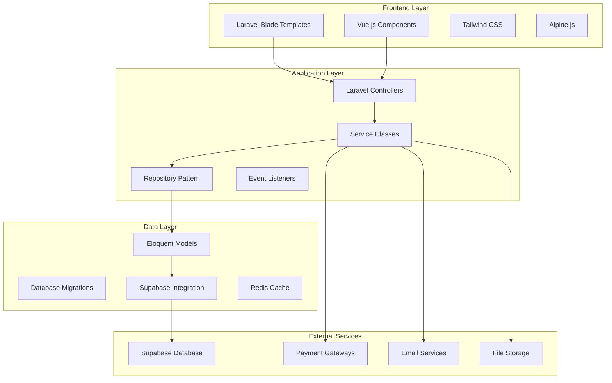

# Noxxi Web Platform Design Document

## Overview

The Noxxi Web Platform is a comprehensive Laravel-based web application that serves as the administrative and power-user interface for the Noxxi event ticketing ecosystem. Built using Laravel 10 with modern PHP 8.2+ features, the platform provides advanced functionality for event management, analytics, administration, and public-facing event discovery.

The platform will integrate seamlessly with the existing Supabase database while providing enhanced web-specific features and a superior user experience for desktop and tablet users.

## Architecture

### High-Level Architecture



### Technology Stack

**Backend Framework:**
- Laravel 10.x with PHP 8.2+
- Laravel Sanctum for API authentication
- Laravel Horizon for queue management
- Laravel Scout for search functionality
- laravel filament for Dashboards

**Frontend Technologies:**
- Laravel Blade templating engine
- Vue.js 3 for interactive components
- Tailwind CSS for styling
- Alpine.js for lightweight interactions
- Chart.js for analytics visualization

**Database & Caching:**
- Supabase PostgreSQL (existing database) - offered by supabase
- Redis for caching and sessions
- Laravel Eloquent ORM with custom Supabase adapter(adapt on the existing files)

**External Integrations:**
- Supabase Realtime for live updates
- Multiple payment gateways (M-Pesa, Stripe, PayPal)
- Email services (SendGrid, Mailgun)
- File storage (AWS S3, Cloudinary)

## Components and Interfaces

### 1. Authentication & Authorization System

**Multi-Provider Authentication:**
```php
// Custom Supabase Authentication Guard
class SupabaseGuard implements Guard
{
    public function authenticate(Request $request): ?User
    {
        // Integrate with Supabase Auth
        // Support JWT tokens from mobile app
        // Handle role-based permissions
    }
}
```

**Role-Based Access Control:**
- Admin: Full platform access
- Organizer: Event management and analytics
- Manager: Limited event management(he can scan ticker(he is relevant in the mobile app) he mush bear the organiser who made him manager)
- User: Personal dashboard and preferences

### 2. Dashboard System

**Admin Dashboard Components:**
- Platform metrics overview
- User management interface
- Financial reporting tools
- System health monitoring
- Content management system

**Organizer Dashboard Components:**
- Event management interface
- Real-time analytics charts
- Financial tracking and payouts
- Staff management tools
- Marketing campaign manager

**User Dashboard Components:**
- Ticket management interface
- Event preferences and recommendations
- Purchase history and receipts
- Profile and notification settings

### 3. Event Management System

**Event Creation Wizard:**
```php
class EventCreationWizard
{
    protected array $steps = [
        'basic_info',
        'venue_details', 
        'ticket_types',
        'media_upload',
        'marketing_settings',
        'review_publish'
    ];
    
    public function processStep(string $step, array $data): array
    {
        // Validate and process each step
        // Save progress to session
        // Return next step or completion status
    }
}
```

**Advanced Features:**
- Rich text editor for event descriptions
- Multiple image upload with drag-and-drop
- Venue mapping integration
- Recurring event management
- Staff permission assignment
- SEO optimization tools

### 4. Analytics and Reporting Engine

**Real-Time Analytics Dashboard:**
```php
class AnalyticsService
{
    public function getEventMetrics(string $eventId): array
    {
        return [
            'sales_data' => $this->getSalesData($eventId),
            'attendee_demographics' => $this->getDemographics($eventId),
            'revenue_breakdown' => $this->getRevenueBreakdown($eventId),
            'performance_comparison' => $this->getComparison($eventId)
        ];
    }
    
    public function generateReport(array $criteria): Report
    {
        // Generate comprehensive reports
        // Support multiple export formats
        // Schedule automated reports
    }
}
```

**Reporting Features:**
- Interactive charts and graphs
- Customizable date ranges
- Export to PDF, CSV, Excel
- Automated report scheduling
- Comparative analysis tools

### 5. Payment and Financial Management

**Multi-Gateway Payment System:**
```php
interface PaymentGateway
{
    public function processPayment(PaymentRequest $request): PaymentResponse;
    public function refundPayment(string $transactionId, float $amount): RefundResponse;
    public function getTransactionStatus(string $transactionId): TransactionStatus;
}

class MpesaGateway implements PaymentGateway
{
    // M-Pesa specific implementation
}

class StripeGateway implements PaymentGateway  
{
    // Stripe specific implementation
}
```

**Financial Management Features:**
- Automated payout scheduling
- Commission calculation and tracking
- Tax management and reporting
- Invoice generation
- Financial reconciliation tools

### 6. Public Website Interface

**Event Discovery System:**
```php
class EventDiscoveryService
{
    public function searchEvents(SearchCriteria $criteria): Collection
    {
        return Event::search($criteria->query)
            ->where('status', 'published')
            ->where('event_date', '>=', now())
            ->with(['category', 'organizer', 'venue'])
            ->paginate(20);
    }
    
    public function getFeaturedEvents(): Collection
    {
        // Return curated featured events
        // Based on popularity, promotion status, etc.
    }
}
```

**Public Features:**
- Advanced search and filtering
- Event detail pages with rich media
- Streamlined checkout process
- Guest checkout capability
- Social sharing optimization
- Mobile-responsive design

## Data Models

### Enhanced Laravel Models

**Event Model Extensions:**
```php
class Event extends Model
{
    protected $connection = 'supabase';
    
    protected $casts = [
        'ticket_types' => 'array',
        'images' => 'array',
        'tags' => 'array',
        'event_date' => 'datetime',
        'venue_coordinates' => 'array'
    ];
    
    public function analytics(): HasMany
    {
        return $this->hasMany(EventAnalytic::class);
    }
    
    public function getPopularityScoreAttribute(): float
    {
        // Calculate popularity based on multiple factors
    }
    
    public function scopeUpcoming(Builder $query): Builder
    {
        return $query->where('event_date', '>=', now());
    }
}
```

**User Model with Roles:**
```php
class User extends Authenticatable
{
    use HasRoles, Notifiable;
    
    protected $connection = 'supabase';
    protected $table = 'profiles';
    
    public function organizer(): HasOne
    {
        return $this->hasOne(Organizer::class);
    }
    
    public function isOrganizer(): bool
    {
        return $this->role === 'organizer' && $this->organizer?->verification_status === 'verified';
    }
}
```

### Database Integration Strategy

**Supabase Connection Configuration:**
```php
// config/database.php
'supabase' => [
    'driver' => 'pgsql',
    'host' => env('SUPABASE_DB_HOST'),
    'port' => env('SUPABASE_DB_PORT', 5432),
    'database' => env('SUPABASE_DB_DATABASE'),
    'username' => env('SUPABASE_DB_USERNAME'),
    'password' => env('SUPABASE_DB_PASSWORD'),
    'charset' => 'utf8',
    'prefix' => '',
    'schema' => 'public',
    'sslmode' => 'require',
]
```

## Error Handling

### Comprehensive Error Management

**Global Exception Handler:**
```php
class Handler extends ExceptionHandler
{
    public function render($request, Throwable $exception)
    {
        if ($exception instanceof PaymentException) {
            return $this->handlePaymentError($request, $exception);
        }
        
        if ($exception instanceof SupabaseConnectionException) {
            return $this->handleDatabaseError($request, $exception);
        }
        
        return parent::render($request, $exception);
    }
    
    private function handlePaymentError($request, PaymentException $exception)
    {
        // Log payment errors
        // Notify administrators
        // Return user-friendly error response
    }
}
```

**Error Logging and Monitoring:**
- Structured logging with context
- Real-time error notifications
- Performance monitoring integration
- User-friendly error pages

## Testing Strategy

### Comprehensive Testing Approach

**Unit Testing:**
```php
class EventServiceTest extends TestCase
{
    public function test_event_creation_with_valid_data()
    {
        $eventData = [
            'title' => 'Test Event',
            'organizer_id' => $this->organizer->id,
            'event_date' => now()->addDays(30),
            // ... other required fields
        ];
        
        $event = $this->eventService->createEvent($eventData);
        
        $this->assertInstanceOf(Event::class, $event);
        $this->assertEquals('Test Event', $event->title);
    }
}
```

**Feature Testing:**
- End-to-end user workflows
- Payment processing scenarios
- Authentication and authorization
- API endpoint testing

**Browser Testing:**
- Laravel Dusk for browser automation
- Cross-browser compatibility testing
- Mobile responsiveness testing
- Performance testing

### Testing Infrastructure

**Test Database Setup:**
- Separate test database configuration
- Database seeding for consistent test data
- Transaction rollback for test isolation
- Mock external service integrations

## Security Considerations

### Multi-Layer Security Approach

**Authentication Security:**
- JWT token validation
- Session management
- Two-factor authentication support
- Rate limiting on authentication endpoints

**Data Protection:**
- Input validation and sanitization
- SQL injection prevention
- XSS protection
- CSRF token validation

**API Security:**
- OAuth 2.0 implementation
- API rate limiting
- Request signing for sensitive operations
- Comprehensive audit logging

**Infrastructure Security:**
- HTTPS enforcement
- Security headers implementation
- Regular security updates
- Vulnerability scanning

## Performance Optimization

### Caching Strategy

**Multi-Level Caching:**
```php
class EventCacheService
{
    public function getPopularEvents(): Collection
    {
        return Cache::tags(['events', 'popular'])
            ->remember('popular_events', 3600, function () {
                return Event::popular()->with(['category', 'organizer'])->get();
            });
    }
    
    public function invalidateEventCache(Event $event): void
    {
        Cache::tags(['events'])->flush();
        Cache::forget("event.{$event->id}");
    }
}
```

**Performance Features:**
- Redis caching for frequently accessed data
- Database query optimization
- Image optimization and CDN integration
- Lazy loading for large datasets
- Background job processing for heavy operations

### Scalability Considerations

**Horizontal Scaling:**
- Stateless application design
- Load balancer compatibility
- Session storage in Redis
- File storage in cloud services

**Database Optimization:**
- Connection pooling
- Read replica support
- Query optimization
- Index management

This design provides a comprehensive foundation for building a robust, scalable, and feature-rich web platform that complements the existing mobile application while providing enhanced functionality for power users and administrators.